# FPGA Internship Screening – RTL Design Experiments

This repository showcases my work on basic RTL design concepts using Verilog. It includes implementation, simulation, and synthesis of digital circuits such as multiplexers, flip-flops, and multipliers. The goal is to strengthen my understanding of FPGA design flow using industry-relevant tools.

---

## 🔍 Project Summary
The repository demonstrates:
- Writing RTL code in Verilog  
- Running simulations using Icarus Verilog  
- Viewing signal behavior through GTKWave  
- Performing synthesis using Yosys  

Each module includes both simulation waveforms and synthesized outputs for better analysis.

---

## 🛠️ Tools & Technologies
- Icarus Verilog (Simulation)
- GTKWave (Waveform Viewer)
- Yosys (Synthesis Tool)

---

## 📁 Module 1: Multiplexer (MUX)

### Description
Implementation of a basic multiplexer along with a testbench to verify functionality.

### Files
- `good_mux.v` – RTL design  
- `tb_good_mux.v` – Testbench  

### 📊 Simulation Output
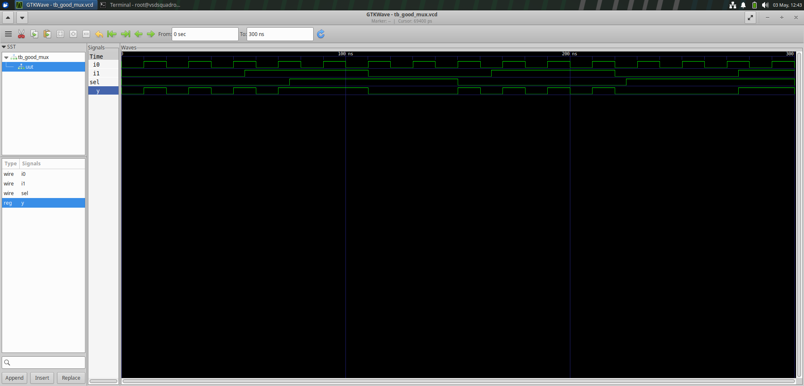

### 🔧 Synthesis Output
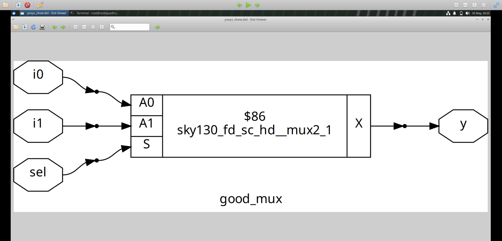
### Code
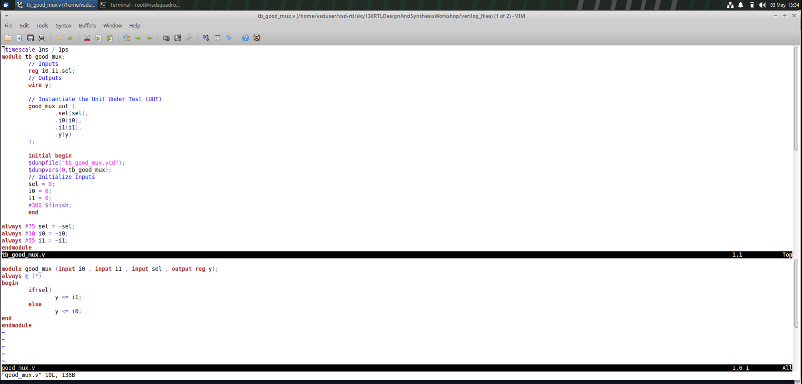

---

## 📁 Module 2: D Flip-Flops

This section explores different types of D flip-flops based on control signals.

### 🔹 1. Asynchronous SET DFF
#### 📊 Outputs
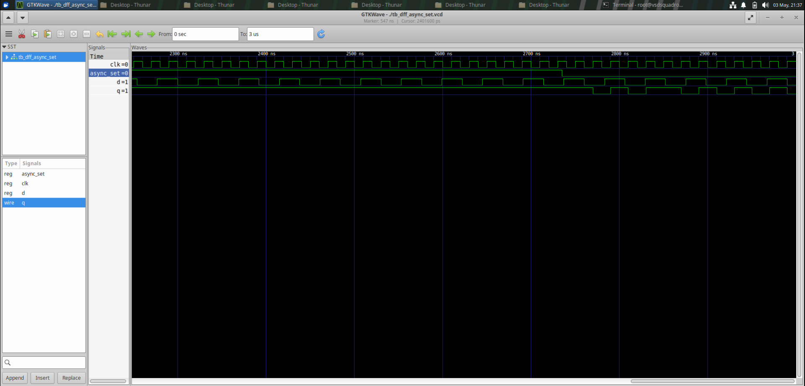  

#### 🔧 Synthesis
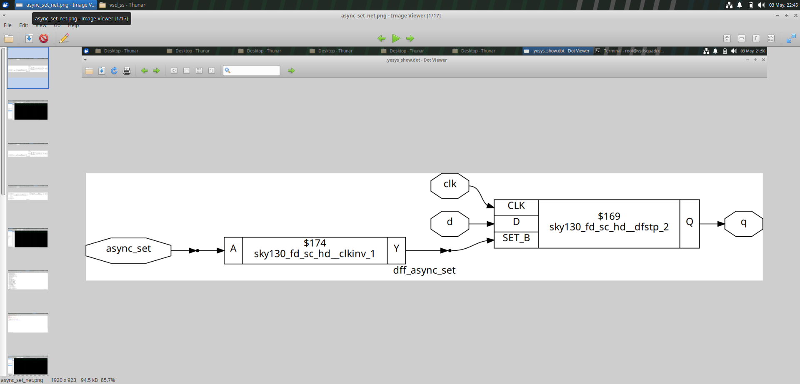

---

### 🔹 2. Asynchronous RESET DFF
#### 📊 Outputs
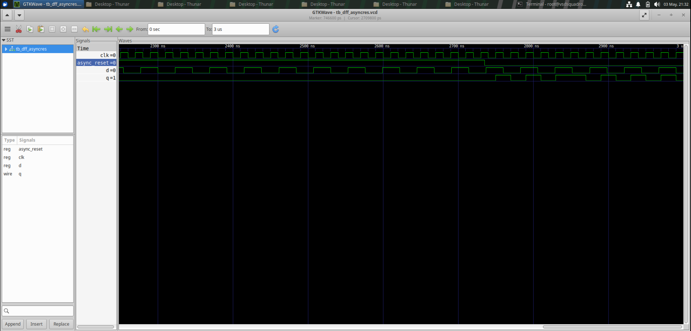  

#### 🔧 Synthesis
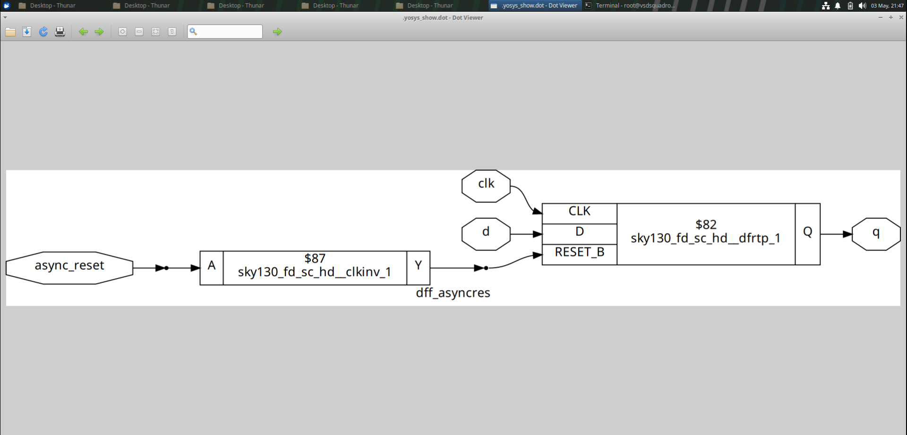

---

### 🔹 3. Synchronous RESET DFF
#### 📊 Outputs
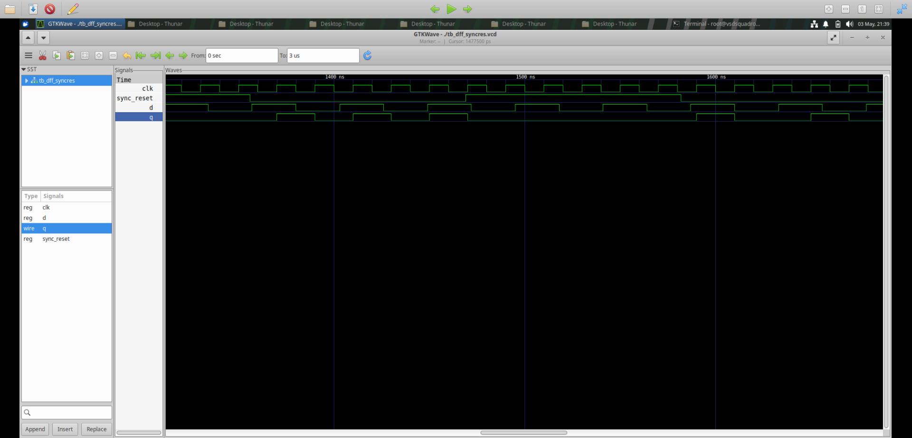

#### 🔧 Synthesis
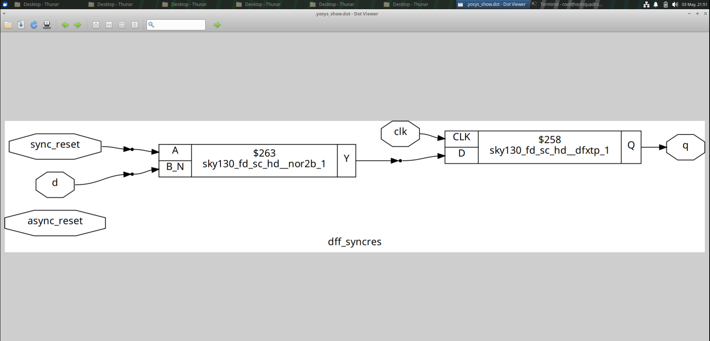

---

## 📁 Module 3: Design Hierarchy (Hierarchical vs Flat)

### Description
Comparison between hierarchical and flattened design approaches.

### 🔧 Synthesis
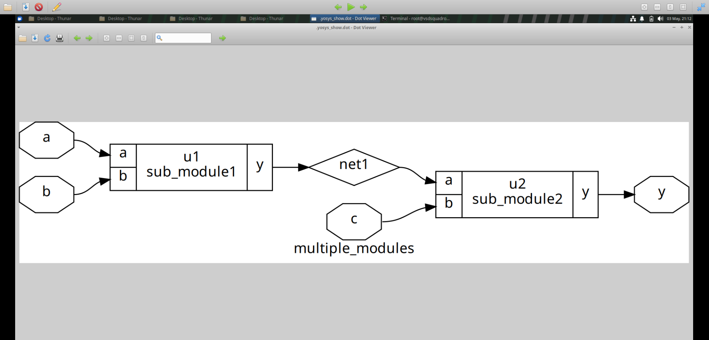  
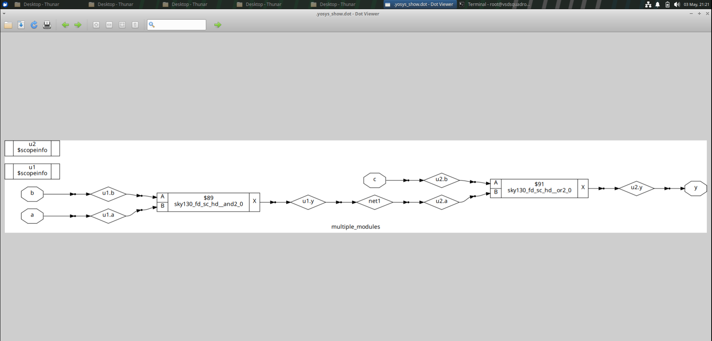

---

## 📁 Module 4: Submodule Design

### Description
Demonstrates modular design by integrating submodules within a top-level module.

### 🔧 Synthesis
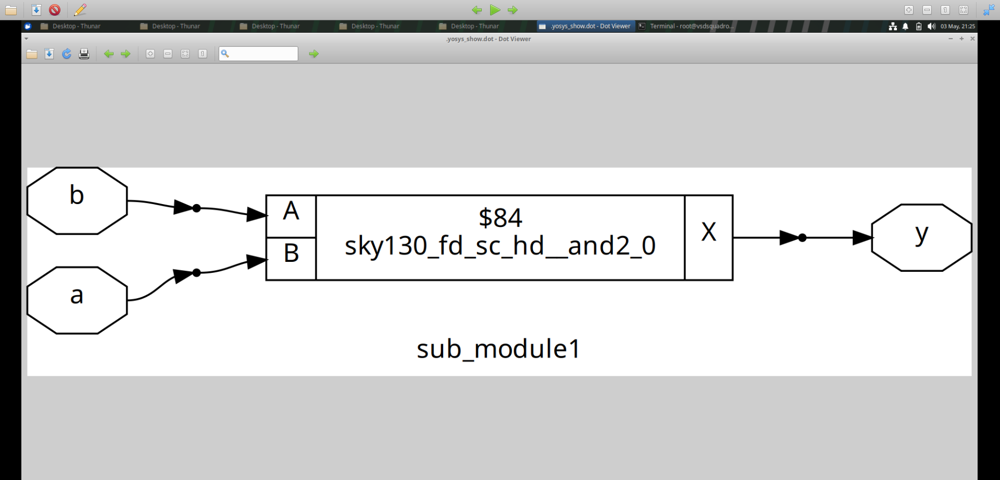

---

## 📊 Key Learnings
- Understanding RTL design flow from coding to synthesis  
- Difference between synchronous and asynchronous control  
- Importance of testbenches in verification  
- Role of hierarchy in digital design  

---

## 🚀 Future Improvements
- Add more complex designs (ALU, FSM, etc.)  
- Include timing analysis  
- Automate simulation using scripts  

---

